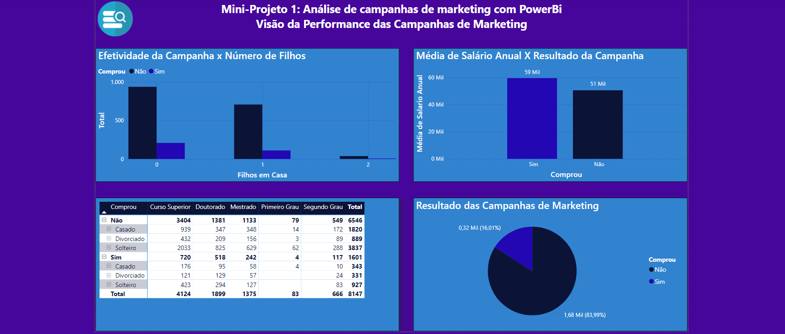
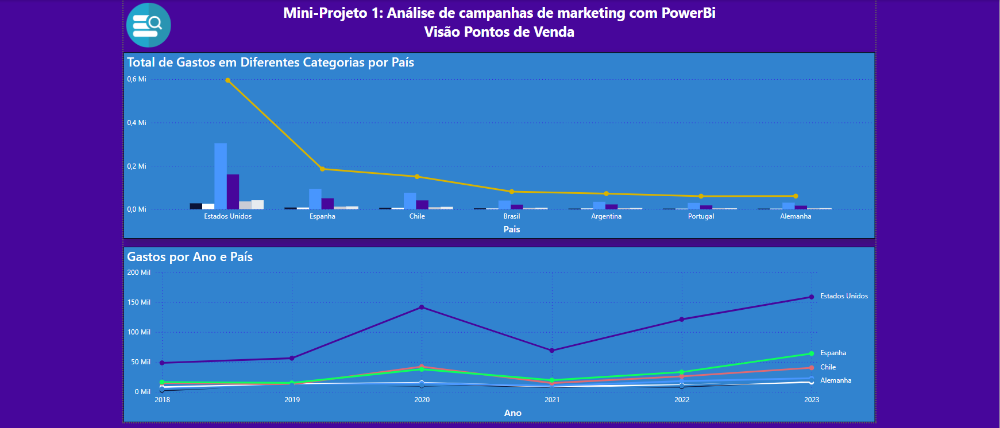
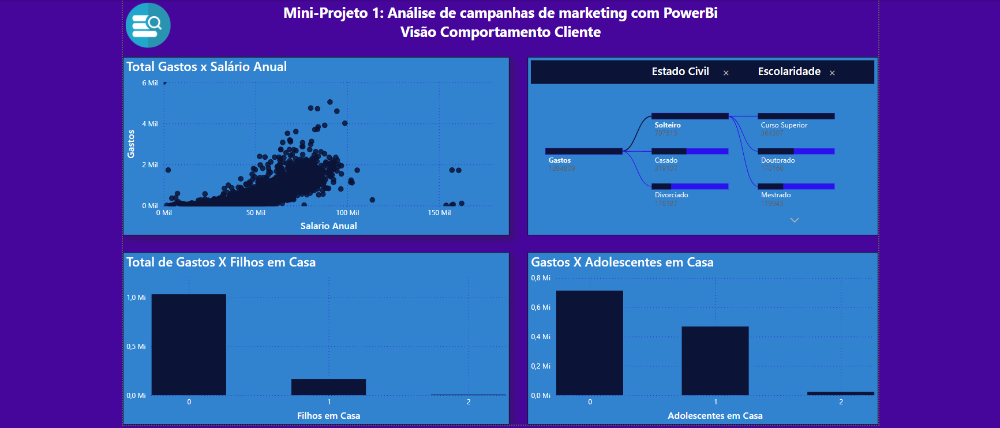

# Projeto Marketing Power Bi
 Projeto de analise de dados de marketing em Power BI desenvolvido no curso do Data Science Academy.

 ## Cliente
 

 ## Performance das campanhas de Marketing

## Pontos de Venda

## Visão Comportamento
